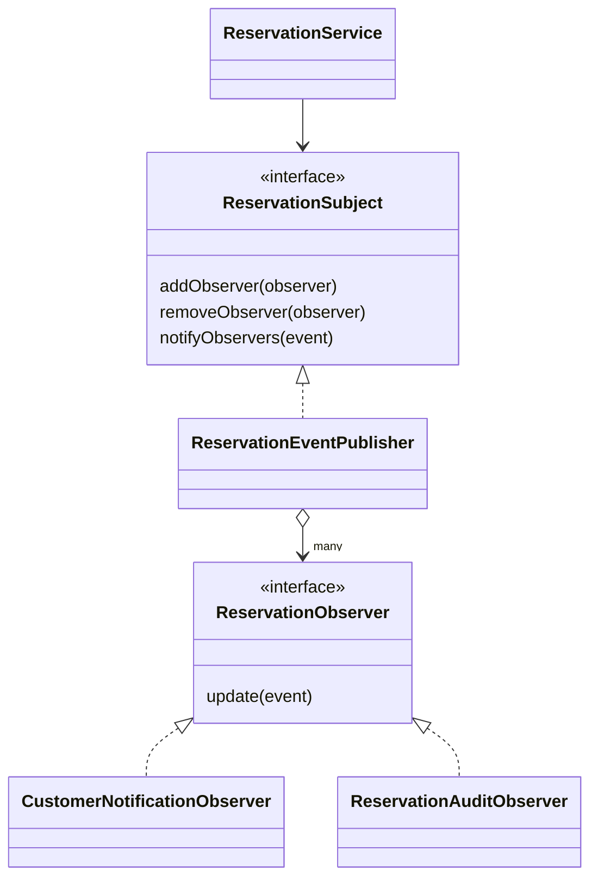

# Gather: Design patterns presentation guide

Implemented patterns: **Payment Strategy** and **Reservation Observer**.
The reservation Observer is the table/reservations contribution. It follows the
Subject/Observer structure in Part I. Payment Strategy follows the payment
example in Part II. No additional pattern is required to explain these features.

## 1. Reservation Observer (your contribution)

### The problem

Creating or changing a reservation must notify its customer and record its
history. Directly calling every reaction from ReservationService couples booking
rules to notification and audit implementations. Adding another reaction would
require modifying the service again.

### The solution and lecture roles

| Lecture role | Project class | Responsibility |
| --- | --- | --- |
| Subject | ReservationSubject | addObserver, removeObserver, notifyObservers |
| ConcreteSubject | ReservationEventPublisher | Keeps the observer list and notifies each subscriber |
| Observer | ReservationObserver | Declares update(event) |
| ConcreteObserver | CustomerNotificationObserver | Creates the customer's in-app notification |
| ConcreteObserver | ReservationAuditObserver | Records the action, old/new status and acting user |
| Change data | ReservationEvent | Carries the reservation ID/reference, customer, actor, action and status |
| Caller | ReservationService | Validates and saves a reservation change, then publishes it |



Read these files in this order under
`restaurant-event-backend/src/main/java/com/group06/restaurantevent/`:

1. `reservations/observer/ReservationObserver.java`
2. `reservations/observer/ReservationSubject.java`
3. `reservations/observer/ReservationEventPublisher.java`
4. The two concrete observers in the same folder
5. `reservations/service/ReservationService.java`: `publishChange()` and its callers

The main loop is deliberately simple:

```java
for (ReservationObserver observer : observers) {
    observer.update(event);
}
```

Spring supplies the two observer objects at startup. The publisher registers them
through addObserver. addObserver prevents duplicate subscriptions; removeObserver
unsubscribes an observer. CopyOnWriteArrayList is just a standard Java list safe
for notification when another request adds/removes a subscriber. It is not a new
pattern. The event is passed as a method argument, rather than stored as shared
"last reservation" state, so concurrent bookings do not mix their data.

### What actually happens

Reservation CREATED / UPDATED / CONFIRMED / CANCELLED / CHECKED_IN / COMPLETED /
NO_SHOW -> publisher -> both observers.

Business rules, table occupancy and payment cancellation/refund handling stay in
ReservationService and the payment service. They are mandatory booking operations,
not optional notification subscribers.

Both observers run synchronously in the reservation's existing database
transaction. If either fails, its exception propagates and the transaction rolls
back the reservation change, notification and audit write. Nothing is silently
ignored. This is intentionally a small, local Observer implementation without
queues, background workers or external SMS.

Notifications are stored in the database. The existing UI fetches them; the
Observer itself does not push live changes into the browser.

### Demo (about 2 minutes)

1. Create a valid reservation for a customer, using the customer form or the admin
   Add reservation form. Keep the reference and date.
2. On the admin Reservation calendar, select that date and press **History**.
   Show CREATED and CONFIRMED. For an admin-created booking, the actor is the
   admin, while the notification belongs to the customer.
3. Check in the customer. History now shows CONFIRMED -> CHECKED IN.
4. Complete the reservation. Show CHECKED IN -> COMPLETED.
5. In the corresponding customer's account, show the in-app notifications.
   Refresh/wait for the existing notification refresh if necessary.
6. Show the publisher loop and the two update() implementations in source.

Alternatively, cancel a separate upcoming reservation from its customer account
and show the cancellation notification and history. Do not cancel a checked-in
or completed booking; the existing validation correctly rejects that.

Old bookings have no retroactively invented history. Their history starts with
changes performed after this implementation.

### Sinhala explanation you can practise

“මගේ table reservation component එකේ Observer Pattern එක භාවිතා කරනවා.
Reservation එකක් වෙනස් වුණාම customer notification එකත් audit history එකත්
update කරන්න අවශ්‍යයි. ඒ reactions දෙකම ReservationService එකේ ලිව්වොත්
service එක ඒ implementations වලට තදින් බැඳෙනවා. ඒ නිසා මම reservation
change එක Subject එකට යවනවා. Subject එක registered observers දෙකට update
method එක හරහා දැනුම් දෙනවා. Notification observer එක message එක හදනවා.
Audit observer එක වෙනස record කරනවා. අලුත් reaction එකක් එකතු කරන්න මේ
interface එක implement කරන observer එකක් එකතු කරන්න පුළුවන්.”

### Likely questions

- **Who is the observer?** The software subscriber classes, not the customers or admins themselves.
- **Why two observers?** One change triggers two independent reactions.
- **Why not just call both methods?** That works for a small system; Observer
  separates these reactions and permits additional subscribers without editing
  booking rules. The tradeoff is extra interfaces/classes.
- **Does execution order matter?** These observers do not depend on one another.
  We do not rely on Spring's registration order.
- **What if an observer fails?** We propagate the failure and roll back the whole
  database transaction, rather than claiming a successful booking with missing history.
- **Is the notification factory the Observer?** No. CustomerNotificationObserver
  implements the observer interface and uses the existing notification helper.
- **Is this a real-time browser push system?** No. It writes notifications; the
  browser fetches them using the existing UI refresh.

## 2. Payment Strategy

### Problem and solution

Card settlement and outlet settlement are two interchangeable behaviours for the
same payment operation. A large if/else in the payment service would mix these
rules into the common booking/payment logic.

| Role | Project code |
| --- | --- |
| Context | CustomerPaymentService |
| Strategy | PaymentMethodStrategy |
| Concrete strategies | CardPaymentStrategy, PayAtOutletPaymentStrategy |
| Client selection | Customer chooses the method at checkout |

The service selects the strategy and delegates:

```java
strategyFor(req.getMethod()).apply(payment, req.getCard());
```

Card validates input, sets PAID and records only limited card metadata. Outlet
sets PENDING and clears card metadata. The gateway remains simulated; do not
present it as a live banking integration.

Review improvements:

- Strategy-level validation rejects missing/invalid card fields even without MVC
  validation; malformed expiry or missing number does not cause an accidental server error.
- Expiry checks use Asia/Colombo.
- Duplicate strategies for one payment method fail at startup rather than silently
  replacing an implementation.
- Existing 12-digit simulated-card rule is retained.

Adding a future method would involve a new strategy and method enum/UI/API
configuration. It avoids putting the new settlement algorithm inside the context;
it does not mean absolutely no other existing file ever changes.

Demo: pay one booking with a card and show PAID; choose outlet for a separate
booking and show PENDING. Then show the interface and both apply() methods.

## Verification

- Publisher tests verify both callbacks, duplicate subscription prevention,
  unsubscribe and exception propagation.
- Integration test verifies check-in/complete produce notification/history,
  correct actor identity, failed repeat check-in creates no extra audit entry,
  and customer access to the admin history endpoint is forbidden.
- Strategy tests invoke both implementations through the interface and directly
  reject malformed/null card input.
- The complete backend suite and frontend production build are run after changes.

The presentation announcement requires at least one suitable pattern and
understanding. Two patterns do not guarantee extra marks. Demonstrate the real
behaviour and explain the roles, problem, advantages and costs confidently.
