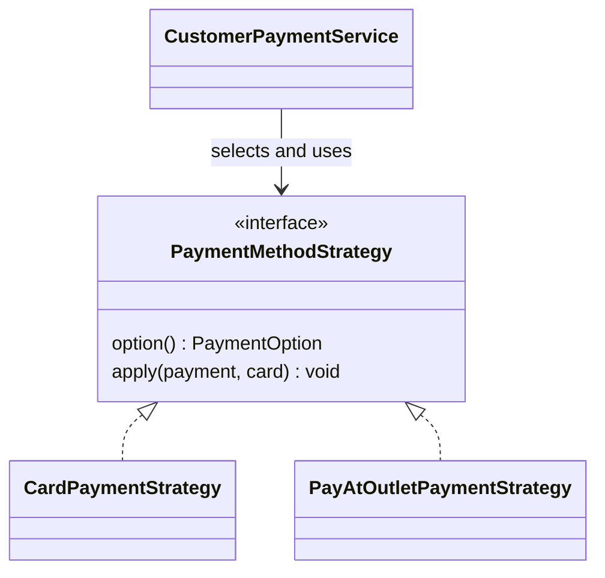

# Payment Strategy Pattern: Code Explained Simply

This guide explains the **actual Java code in Gather**, using the Strategy roles from the lecture. It includes the complete Strategy interface and both implementations, the strategy-related service code, supporting request classes, and the complete service in an appendix.

The examples use our simulated checkout. No real bank transaction takes place. Our 12-digit card rule is a project simulation rule, not a general rule for real payment cards.

## 1. Understand the idea first

We have one task: **handle a customer payment**. There are two different ways to do it:

- **Card payment:** validate the card details and mark the simulated payment PAID.
- **Pay at the outlet:** mark the payment PENDING until staff collect it.

Strategy puts these behaviours in separate classes. Both classes follow one interface. The service selects one class and calls its common method.

| Lecture role | Our class | Simple meaning |
| --- | --- | --- |
| Context | CustomerPaymentService | Chooses and uses a payment behaviour |
| Strategy interface | PaymentMethodStrategy | The common contract |
| Concrete Strategy | CardPaymentStrategy | The card behaviour |
| Concrete Strategy | PayAtOutletPaymentStrategy | The outlet behaviour |
| Client selection | Customer's checkout choice | Chooses CARD or PAY_AT_OUTLET |



**The most important idea:** the same call, `apply(payment, card)`, executes different code depending on which strategy object was selected.

## 2. PaymentOption: the choices


**Source:** [PaymentOption.java](/Users/upanianupajaabhayarathnakodithuwakku/Documents/2y1s/web-based-event-and-restaurant-management-/restaurant-event-backend/src/main/java/com/group06/restaurantevent/common/enums/PaymentOption.java)

```java
package com.group06.restaurantevent.common.enums;

public enum PaymentOption {
    CARD, PAY_AT_OUTLET
}
```


An `enum` is a fixed list of named choices. `CARD` identifies the card strategy. `PAY_AT_OUTLET` identifies the outlet strategy. The enum helps the service select the correct object; it is not the Strategy Pattern by itself.

## 3. PaymentMethodStrategy: the shared interface


**Source:** [PaymentMethodStrategy.java](/Users/upanianupajaabhayarathnakodithuwakku/Documents/2y1s/web-based-event-and-restaurant-management-/restaurant-event-backend/src/main/java/com/group06/restaurantevent/payment/strategy/PaymentMethodStrategy.java)

```java
package com.group06.restaurantevent.payment.strategy;

import com.group06.restaurantevent.common.enums.PaymentOption;
import com.group06.restaurantevent.payment.dto.request.CardDetailsRequest;
import com.group06.restaurantevent.payment.entity.CustomerPayment;

/**
 * Strategy pattern: each payment method decides how a payment is settled.
 * Adding a method means adding a strategy, not changing CustomerPaymentService.
 */
public interface PaymentMethodStrategy {
    PaymentOption option();

    /** Applies this method to the payment, setting status and method-specific fields. */
    void apply(CustomerPayment payment, CardDetailsRequest card);
}
```


- `interface` defines what every payment strategy must provide.
- `option()` tells the service which payment method this strategy handles.
- `apply(...)` defines the common operation. It changes the supplied payment object's method, status and relevant metadata.
- `CustomerPayment payment` is the payment object to update.
- `CardDetailsRequest card` contains input card details. The outlet strategy does not need them.
- `void` means `apply()` does not return a value. It updates the existing payment object.

The interface does not contain the actual card or outlet algorithm. Those belong to the classes below. A service variable can use the interface type while holding either implementation.

## 4. CardPaymentStrategy: the first behaviour


**Source:** [CardPaymentStrategy.java](/Users/upanianupajaabhayarathnakodithuwakku/Documents/2y1s/web-based-event-and-restaurant-management-/restaurant-event-backend/src/main/java/com/group06/restaurantevent/payment/strategy/CardPaymentStrategy.java)

```java
package com.group06.restaurantevent.payment.strategy;

import com.group06.restaurantevent.common.enums.PaymentOption;
import com.group06.restaurantevent.common.enums.PaymentStatus;
import com.group06.restaurantevent.common.exception.BadRequestException;
import com.group06.restaurantevent.payment.dto.request.CardDetailsRequest;
import com.group06.restaurantevent.payment.entity.CustomerPayment;
import org.springframework.stereotype.Component;

import java.time.LocalDateTime;
import java.time.YearMonth;
import java.util.UUID;

/**
 * Simulated card gateway for the project: any 12-digit card number with a valid
 * expiry and CVV is approved and settled immediately.
 */
@Component
public class CardPaymentStrategy implements PaymentMethodStrategy {

    @Override
    public PaymentOption option() { return PaymentOption.CARD; }

    @Override
    public void apply(CustomerPayment payment, CardDetailsRequest card) {
        if (card == null)
            throw new BadRequestException("Card details are required to pay by card");

        if (card.getHolderName() == null || card.getHolderName().isBlank() || card.getHolderName().length() > 100)
            throw new BadRequestException("Enter a cardholder name of up to 100 characters");
        if (card.getNumber() == null)
            throw new BadRequestException("Card number is required");
        if (card.getExpiry() == null || !card.getExpiry().matches("(0[1-9]|1[0-2])/[0-9]{2}"))
            throw new BadRequestException("Expiry date must be in MM/YY format");
        if (card.getCvv() == null || !card.getCvv().matches("[0-9]{3,4}"))
            throw new BadRequestException("CVC must have 3 or 4 digits");
        String digits = card.getNumber().replace(" ", "");
        if (!digits.matches("\\d{12}"))
            throw new BadRequestException("Card number must have exactly 12 digits");
        if (expiry(card.getExpiry()).isBefore(YearMonth.now(java.time.ZoneId.of("Asia/Colombo"))))
            throw new BadRequestException("Card has expired");

        // The full number and CVV are used for validation only and never stored.
        payment.setMethod(PaymentOption.CARD);
        payment.setStatus(PaymentStatus.PAID);
        payment.setCardHolderName(card.getHolderName().trim());
        payment.setCardLast4(digits.substring(digits.length() - 4));
        payment.setCardBrand(brand(digits));
        payment.setGatewayReference("SIM-" + UUID.randomUUID().toString().substring(0, 12).toUpperCase());
        payment.setPaidAt(LocalDateTime.now(java.time.ZoneId.of("Asia/Colombo")));
    }

    private YearMonth expiry(String mmYy) {
        String[] parts = mmYy.split("/");
        return YearMonth.of(2000 + Integer.parseInt(parts[1]), Integer.parseInt(parts[0]));
    }

    private String brand(String digits) {
        if (digits.startsWith("4")) return "VISA";
        if (digits.matches("^(5[1-5]|222[1-9]|22[3-9]\\d|2[3-6]\\d{2}|27[01]\\d|2720).*")) return "MASTERCARD";
        if (digits.startsWith("34") || digits.startsWith("37")) return "AMEX";
        return "CARD";
    }
}
```


### Explanation, in execution order

1. `@Component` tells Spring to create and manage an object of this class. It helps register the implementation; the annotation alone is not a design pattern.
2. `implements PaymentMethodStrategy` means this class must provide `option()` and `apply()`.
3. `@Override` indicates that a method implements a method declared by the interface.
4. `option()` returns `PaymentOption.CARD`, so the service knows how to find this strategy.
5. `apply()` rejects missing card details and validates the holder name, number, expiry and CVC. `throw new BadRequestException(...)` stops processing with a validation error.
6. `replace(" ", "")` removes spaces from a formatted card number. The number must then contain exactly 12 digits.
7. `expiry(...)` converts MM/YY into a `YearMonth`. The strategy rejects an expired month using Asia/Colombo time. A card expiring in the current month is accepted.
8. `setMethod(CARD)` and `setStatus(PAID)` record the successful simulated outcome.
9. `trim()` removes extra spaces around the holder name. `substring(...)` keeps only the last four card digits.
10. `brand(...)` chooses a display label from the number prefix. It does not verify a real bank-issued card.
11. `UUID.randomUUID()` creates a simulated gateway reference. `setPaidAt(...)` records the payment time.

The strategy does **not** save the full number or CVC. It also does **not** save to the database directly. The service saves the modified payment after `apply()` succeeds.

### Small Java details

- `null` means a value is missing.
- `||` means OR. A validation rejects the input if any listed condition is true.
- `!` means NOT.
- `matches(...)` checks a regular expression: the expiry expression accepts months 01–12 with a two-digit year; `[0-9]{3,4}` accepts three or four digits; `\\d{12}` checks 12 digits in a Java string.
- In `expiry()`, `split("/")` separates month and year. Adding 2000 converts `29` to `2029`.
- In `brand()`, `startsWith(...)` and prefix checks select the label. These validation/display checks are not the part that makes the code Strategy.

**What makes this a strategy:** the whole card behaviour implements the shared `apply()` contract in its own class.

## 5. PayAtOutletPaymentStrategy: the second behaviour


**Source:** [PayAtOutletPaymentStrategy.java](/Users/upanianupajaabhayarathnakodithuwakku/Documents/2y1s/web-based-event-and-restaurant-management-/restaurant-event-backend/src/main/java/com/group06/restaurantevent/payment/strategy/PayAtOutletPaymentStrategy.java)

```java
package com.group06.restaurantevent.payment.strategy;

import com.group06.restaurantevent.common.enums.PaymentOption;
import com.group06.restaurantevent.common.enums.PaymentStatus;
import com.group06.restaurantevent.payment.dto.request.CardDetailsRequest;
import com.group06.restaurantevent.payment.entity.CustomerPayment;
import org.springframework.stereotype.Component;

/** The customer pays at the restaurant; staff mark it paid when they collect it. */
@Component
public class PayAtOutletPaymentStrategy implements PaymentMethodStrategy {

    @Override
    public PaymentOption option() { return PaymentOption.PAY_AT_OUTLET; }

    @Override
    public void apply(CustomerPayment payment, CardDetailsRequest card) {
        payment.setMethod(PaymentOption.PAY_AT_OUTLET);
        payment.setStatus(PaymentStatus.PENDING);
        payment.setCardHolderName(null);
        payment.setCardLast4(null);
        payment.setCardBrand(null);
        payment.setGatewayReference(null);
        payment.setPaidAt(null);
    }
}
```


- This class implements the same interface as the card strategy.
- `option()` identifies it as `PAY_AT_OUTLET`.
- `apply()` sets the method to outlet and the status to `PENDING`.
- Card fields and the previous payment timestamp are cleared because this choice does not collect a card payment now.
- The `card` parameter is unused, but it remains part of the shared interface.
- Staff mark this payment PAID later, when they collect the money.

**Important:** Strategy selects one of these behaviours per payment operation. It does not execute both strategies for one payment.

## 6. CustomerPaymentService: the Context

This service also contains normal business rules: checking the customer, booking status, amount, duplicate payments and saving data. Those are not all part of the pattern. The strategy-related sections are explained first; its complete source is included in Appendix A.

### A. Store the available strategies


```java
private final Map<PaymentOption, PaymentMethodStrategy> strategies;
```


A `Map` is a lookup table: a key points to a value. Here the key is the payment option and the value is the corresponding strategy object.

```text
CARD          -> CardPaymentStrategy object
PAY_AT_OUTLET -> PayAtOutletPaymentStrategy object
```

### B. Register the strategies in the constructor

The actual constructor is shown below. The repositories are database dependencies; `strategyList` is the important Strategy dependency.


```java
    public CustomerPaymentService(CustomerPaymentRepository paymentRepository,
                                  FoodOrderRepository orderRepository,
                                  EventBookingRepository bookingRepository,
                                  UserRepository userRepository,
                                  AuditLogRepository auditLogRepository,
                                  List<PaymentMethodStrategy> strategyList,
                                  TableReservationRepository reservationRepository,
                                  @Value("${app.reservation.deposit-per-guest:500}
```


- Spring supplies `List<PaymentMethodStrategy> strategyList` containing the two `@Component` implementations.
- `new EnumMap<>(PaymentOption.class)` creates a map whose keys are enum values.
- The `for` loop registers each object using the option returned by its `option()` method.
- `putIfAbsent(...)` adds it only if that payment option is not already registered. A duplicate causes a startup error rather than silently replacing a strategy.
- The other assignments store repositories and configure the per-guest deposit. They are application setup, not extra design patterns.

This is why the service can use the interface without creating the concrete strategies with `new` itself.

### C. Select the correct strategy


```java
    private PaymentMethodStrategy strategyFor(String method) {
        PaymentOption option;
        try { option = PaymentOption.valueOf(method.trim().toUpperCase()); }
        catch (Exception e) { throw new BadRequestException("Invalid payment method: " + method); }
        PaymentMethodStrategy strategy = strategies.get(option);
        if (strategy == null) throw new BadRequestException("Payment method is not supported: " + method);
        return strategy;
    }
```


1. The request provides a string such as `"CARD"`.
2. `trim().toUpperCase()` normalizes it.
3. `PaymentOption.valueOf(...)` converts it to an enum. An invalid value produces a clear validation error.
4. `strategies.get(option)` looks up the corresponding object.
5. If no implementation is registered, the service rejects the unsupported method.
6. `return strategy` returns an object through the interface type.

For CARD it returns a CardPaymentStrategy object. For PAY_AT_OUTLET it returns a PayAtOutletPaymentStrategy object.

### D. Use the selected strategy during payment creation


```java
    public CustomerPaymentResponse create(String customerEmail, CreateCustomerPaymentRequest req) {
        Long customerId = findUserByEmail(customerEmail).getId();
        boolean forOrder = req.getFoodOrderId() != null;
        int targets = (forOrder ? 1 : 0) + (req.getEventBookingId() != null ? 1 : 0) + (req.getTableReservationId() != null ? 1 : 0);
        if (targets != 1) throw new BadRequestException("Choose exactly one food order, event booking or table reservation");

        CustomerPayment payment = CustomerPayment.builder()
                .paymentReference(generateReference())
                .customerId(customerId)
                .build();

        if (forOrder) {
            FoodOrder order = findOrder(req.getFoodOrderId());
            requireOwner(order.getCustomerId(), customerId);
            if (order.getStatus() == OrderStatus.CANCELLED)
                throw new ConflictException("This order was cancelled");
            if (paymentRepository.existsByFoodOrderId(order.getId()))
                throw new ConflictException("A payment already exists for this order");
            payment.setPurpose(PaymentPurpose.FOOD_ORDER);
            payment.setFoodOrderId(order.getId());
            payment.setAmount(foodTotal(order));
        } else if (req.getTableReservationId() != null) {
            TableReservation reservation = findReservation(req.getTableReservationId());
            requireOwner(reservation.getCustomer().getId(), customerId);
            requirePayableReservation(reservation);
            if (paymentRepository.existsByTableReservationId(reservation.getId()))
                throw new ConflictException("A payment already exists for this reservation");
            payment.setPurpose(PaymentPurpose.TABLE_RESERVATION);
            payment.setTableReservationId(reservation.getId());
            payment.setAmount(reservationTotal(reservation));
        } else {
            EventBooking booking = findBooking(req.getEventBookingId());
            requireOwner(booking.getCustomerId(), customerId);
            if (booking.getStatus() != EventBookingStatus.CONFIRMED)
                throw new ConflictException("This event booking has not been confirmed by our staff yet");
            if (paymentRepository.existsByEventBookingId(booking.getId()))
                throw new ConflictException("A payment already exists for this event booking");
            payment.setPurpose(PaymentPurpose.EVENT_BOOKING);
            payment.setEventBookingId(booking.getId());
            payment.setAmount(eventTotal(booking));
        }

        strategyFor(req.getMethod()).apply(payment, req.getCard());
        CustomerPayment saved = paymentRepository.save(payment);
        return toResponse(saved);
    }
```


Read this method in three stages:

1. **Before the strategy:** identify the customer and exactly one target—food order, event booking or table reservation. Check ownership, eligibility and duplicate payment records, then calculate the amount.
2. **The Strategy call:** `strategyFor(req.getMethod()).apply(payment, req.getCard());` selects a behaviour and executes it.
3. **After the strategy:** `paymentRepository.save(payment)` persists the result; `toResponse(saved)` returns the payment response to the UI.

The `if/else` branches above the Strategy call choose the **booking type**, not the **payment algorithm**. Strategy does not remove every conditional from an application; it separates the payment behaviours.

`@Transactional` on the actual method keeps this operation in a database transaction. The code block shows the complete method body; the full class in Appendix A includes that annotation and its imports.

### E. Use it when a customer changes a pending payment method


```java
    public CustomerPaymentResponse updateMethod(Long id, String customerEmail, UpdateCustomerPaymentRequest req) {
        CustomerPayment payment = findPayment(id);
        requireOwner(payment.getCustomerId(), findUserByEmail(customerEmail).getId());
        if (payment.getStatus() == PaymentStatus.PAID || payment.getStatus() == PaymentStatus.REFUNDED)
            throw new ConflictException("This payment is already " + payment.getStatus().name().toLowerCase());
        validateBookingPayment(payment);
        strategyFor(req.getMethod()).apply(payment, req.getCard());
        CustomerPayment saved = paymentRepository.save(payment);
        return toResponse(saved);
    }
```


This method checks ownership and prevents changing an already PAID or REFUNDED payment. It then calls the same Strategy operation and saves the new result.

For example, a customer can initially select outlet payment (PENDING), then choose card payment. The card strategy is selected for that operation and, if valid, the payment becomes PAID. We do not switch completed payments back to PENDING.

## 7. Supporting request code

These classes carry and validate inputs. They support checkout, but are not additional Strategy roles. Lombok's `@Data` generates getters/setters, which is why the code can call `getNumber()`, `getMethod()` and similar methods without manually writing them.

### Card details


**Source:** [CardDetailsRequest.java](/Users/upanianupajaabhayarathnakodithuwakku/Documents/2y1s/web-based-event-and-restaurant-management-/restaurant-event-backend/src/main/java/com/group06/restaurantevent/payment/dto/request/CardDetailsRequest.java)

```java
package com.group06.restaurantevent.payment.dto.request;

import jakarta.validation.constraints.NotBlank;
import jakarta.validation.constraints.Pattern;
import jakarta.validation.constraints.Size;
import lombok.Data;

/** Simulated card details. Only the last four digits are ever stored. */
@Data
public class CardDetailsRequest {
    @NotBlank(message = "Name on card is required")
    @Size(max = 100, message = "Name on card must be 100 characters or fewer")
    private String holderName;

    @NotBlank(message = "Card number is required")
    @Pattern(regexp = "(?:[0-9] *){12}", message = "Card number must have exactly 12 digits")
    private String number;

    @NotBlank(message = "Expiry date is required")
    @Pattern(regexp = "(0[1-9]|1[0-2])/[0-9]{2}", message = "Expiry date must be in MM/YY format")
    private String expiry;

    @NotBlank(message = "CVV is required")
    @Pattern(regexp = "[0-9]{3,4}", message = "CVV must be 3 or 4 digits")
    private String cvv;
}
```


`@NotBlank` requires a non-empty value. `@Size` limits its length. `@Pattern` checks its format. The strategy also validates these details itself so direct service calls cannot bypass essential checks.

### Creating a payment


**Source:** [CreateCustomerPaymentRequest.java](/Users/upanianupajaabhayarathnakodithuwakku/Documents/2y1s/web-based-event-and-restaurant-management-/restaurant-event-backend/src/main/java/com/group06/restaurantevent/payment/dto/request/CreateCustomerPaymentRequest.java)

```java
package com.group06.restaurantevent.payment.dto.request;

import jakarta.validation.Valid;
import jakarta.validation.constraints.NotBlank;
import lombok.Data;

@Data
public class CreateCustomerPaymentRequest {
    /** Set exactly one of foodOrderId, eventBookingId or tableReservationId. */
    private Long foodOrderId;
    private Long eventBookingId;
    private Long tableReservationId;

    @NotBlank(message = "Payment method is required")
    private String method; // CARD or PAY_AT_OUTLET

    @Valid
    private CardDetailsRequest card;

}
```


Exactly one target ID is required by the service. `method` carries the customer's choice. `@Valid` applies nested validation when card details are provided. For outlet payment, `card` may be absent.

### Changing a pending payment method


**Source:** [UpdateCustomerPaymentRequest.java](/Users/upanianupajaabhayarathnakodithuwakku/Documents/2y1s/web-based-event-and-restaurant-management-/restaurant-event-backend/src/main/java/com/group06/restaurantevent/payment/dto/request/UpdateCustomerPaymentRequest.java)

```java
package com.group06.restaurantevent.payment.dto.request;

import jakarta.validation.Valid;
import jakarta.validation.constraints.NotBlank;
import lombok.Data;

/** Lets a customer change how they pay before the payment is completed. */
@Data
public class UpdateCustomerPaymentRequest {
    @NotBlank(message = "Payment method is required")
    private String method; // CARD or PAY_AT_OUTLET

    @Valid
    private CardDetailsRequest card;

}
```


This request contains the new method and optional card details. The existing payment ID comes from the API URL.

### Payment outcome values


**Source:** [PaymentStatus.java](/Users/upanianupajaabhayarathnakodithuwakku/Documents/2y1s/web-based-event-and-restaurant-management-/restaurant-event-backend/src/main/java/com/group06/restaurantevent/common/enums/PaymentStatus.java)

```java
package com.group06.restaurantevent.common.enums;

public enum PaymentStatus {
    PENDING, PAID, FAILED, REFUNDED
}
```


These are possible stored payment states. The card strategy sets PAID; the outlet strategy sets PENDING. FAILED and REFUNDED are other lifecycle states, not additional strategies.

## 8. Follow one request from start to finish

### Card example

```text
Customer selects CARD and enters valid test details
    -> Controller passes the request to CustomerPaymentService
    -> Service checks the customer, booking and amount
    -> strategyFor("CARD") returns CardPaymentStrategy
    -> apply() validates the card and sets PAID
    -> Service saves the payment and returns the result
```

### Outlet example

```text
Customer selects PAY_AT_OUTLET
    -> Controller passes the request to CustomerPaymentService
    -> Service checks the customer, booking and amount
    -> strategyFor("PAY_AT_OUTLET") returns PayAtOutletPaymentStrategy
    -> apply() sets PENDING and clears card fields
    -> Service saves the payment and returns the result
    -> Staff later record collection of the money
```

The controller receives the HTTP request; it does not implement either payment algorithm. Its complete code is included in Appendix B.

## 9. A small test that demonstrates interchangeability

This is the actual project's strategy test class. Notice that the variable is declared as `PaymentMethodStrategy`, but can hold either implementation.


**Source:** [PaymentStrategyTests.java](/Users/upanianupajaabhayarathnakodithuwakku/Documents/2y1s/web-based-event-and-restaurant-management-/restaurant-event-backend/src/test/java/com/group06/restaurantevent/payment/strategy/PaymentStrategyTests.java)

```java
package com.group06.restaurantevent.payment.strategy;

import com.group06.restaurantevent.payment.dto.request.CardDetailsRequest;
import com.group06.restaurantevent.payment.entity.CustomerPayment;
import com.group06.restaurantevent.common.enums.PaymentStatus;
import com.group06.restaurantevent.common.exception.BadRequestException;
import org.junit.jupiter.api.Test;
import java.time.YearMonth;
import java.time.ZoneId;
import java.time.format.DateTimeFormatter;
import static org.assertj.core.api.Assertions.*;

class PaymentStrategyTests {
    private CardDetailsRequest card() {
        var c = new CardDetailsRequest();
        c.setHolderName(" Customer "); c.setNumber("4242 4242 4242"); c.setCvv("123");
        c.setExpiry(YearMonth.now(ZoneId.of("Asia/Colombo")).plusYears(1).format(DateTimeFormatter.ofPattern("MM/yy")));
        return c;
    }

    @Test void strategiesCanBeSwappedThroughTheSameInterface() {
        var payment = new CustomerPayment();
        PaymentMethodStrategy strategy = new CardPaymentStrategy();
        strategy.apply(payment,card());
        assertThat(payment.getStatus()).isEqualTo(PaymentStatus.PAID);
        assertThat(payment.getCardLast4()).isEqualTo("4242");
        strategy = new PayAtOutletPaymentStrategy();
        strategy.apply(payment,null);
        assertThat(payment.getStatus()).isEqualTo(PaymentStatus.PENDING);
        assertThat(payment.getCardLast4()).isNull();
        assertThat(payment.getPaidAt()).isNull();
    }

    @Test void strategyRejectsInvalidDetailsEvenWhenCalledWithoutControllerValidation() {
        var strategy = new CardPaymentStrategy();
        assertThatThrownBy(() -> strategy.apply(new CustomerPayment(),null)).isInstanceOf(BadRequestException.class);
        var c = card(); c.setExpiry("13/30");
        assertThatThrownBy(() -> strategy.apply(new CustomerPayment(),c)).isInstanceOf(BadRequestException.class);
        c.setExpiry(null);
        assertThatThrownBy(() -> strategy.apply(new CustomerPayment(),c)).isInstanceOf(BadRequestException.class);
        c.setExpiry(card().getExpiry()); c.setCvv("x");
        assertThatThrownBy(() -> strategy.apply(new CustomerPayment(),c)).isInstanceOf(BadRequestException.class);
        c.setCvv("123"); c.setNumber(null);
        assertThatThrownBy(() -> strategy.apply(new CustomerPayment(),c)).isInstanceOf(BadRequestException.class);
        c.setNumber(card().getNumber()); c.setHolderName(" ");
        assertThatThrownBy(() -> strategy.apply(new CustomerPayment(),c)).isInstanceOf(BadRequestException.class);
    }
}
```

The first test calls card behaviour and checks PAID, then changes the strategy object to outlet and checks PENDING and cleared metadata. This is an isolated test of interchangeability; the real service prevents changing an already completed payment.

The second test checks invalid details even when controller validation is not involved. Tests provide evidence that the two implementations work; tests themselves are not the pattern.

## 10. How to explain it during the presentation

> “Our system supports card payment and payment at the outlet. Their rules are different, so we used the Strategy Pattern. PaymentMethodStrategy is the common interface. CardPaymentStrategy and PayAtOutletPaymentStrategy implement it. CustomerPaymentService is the Context. It selects the strategy from the customer's choice and calls apply(). Card payment becomes PAID in our simulated gateway, while outlet payment remains PENDING until collected. This separates the payment behaviours from the common booking and database logic.”

### Questions you may be asked

| Question | Simple answer |
| --- | --- |
| Why Strategy? | We have different interchangeable behaviours for the same payment task. |
| What is the Context? | CustomerPaymentService. |
| What is the interface? | PaymentMethodStrategy. |
| What are the concrete strategies? | CardPaymentStrategy and PayAtOutletPaymentStrategy. |
| Where is the strategy used? | The `strategyFor(...).apply(...)` call in create() and updateMethod(). |
| Why does the interface have option()? | It identifies which method an implementation handles so the service can register and select it. |
| Does @Component create the pattern? | No. It helps Spring create the objects. The interface, separate behaviours and delegation make the pattern. |
| Is the strategy map a Factory Pattern too? | It selects existing strategy objects; we present this as Strategy, not as a separate Factory implementation. |
| Why does the service still have if/else? | Those branches validate different booking types. The payment algorithms are separated into strategies. |
| What is the disadvantage? | More classes and slightly more setup than a small if/else. |
| Can we add another payment method? | Yes: add an implementation, its enum option and any needed API/UI configuration. The new settlement algorithm stays outside the Context. |
| Does the card strategy connect to a bank? | No. This project uses simulated checkout. |

## Appendix A. Complete CustomerPaymentService source

The following is the entire current file, without omitted methods. It includes reporting, refund, mapping and business validation code as well as Strategy. For the pattern presentation, focus on the constructor, strategyFor(), create() and updateMethod(). This file uses other project entities, repositories and DTOs; it is not a standalone Java program.


**Source:** [CustomerPaymentService.java](/Users/upanianupajaabhayarathnakodithuwakku/Documents/2y1s/web-based-event-and-restaurant-management-/restaurant-event-backend/src/main/java/com/group06/restaurantevent/payment/service/CustomerPaymentService.java)

```java
package com.group06.restaurantevent.payment.service;

import com.group06.restaurantevent.common.audit.AuditLog;
import com.group06.restaurantevent.common.audit.AuditLogRepository;
import com.group06.restaurantevent.common.enums.EventBookingStatus;
import com.group06.restaurantevent.common.enums.OrderStatus;
import com.group06.restaurantevent.common.enums.PaymentOption;
import com.group06.restaurantevent.common.enums.PaymentPurpose;
import com.group06.restaurantevent.common.enums.PaymentStatus;
import com.group06.restaurantevent.common.exception.BadRequestException;
import com.group06.restaurantevent.common.exception.ConflictException;
import com.group06.restaurantevent.common.exception.ForbiddenException;
import com.group06.restaurantevent.common.exception.ResourceNotFoundException;
import com.group06.restaurantevent.events.entity.EventBooking;
import com.group06.restaurantevent.events.repository.EventBookingRepository;
import com.group06.restaurantevent.orders.entity.FoodOrder;
import com.group06.restaurantevent.orders.repository.FoodOrderRepository;
import com.group06.restaurantevent.payment.dto.request.CreateCustomerPaymentRequest;
import com.group06.restaurantevent.payment.dto.request.UpdateCustomerPaymentRequest;
import com.group06.restaurantevent.payment.dto.request.UpdatePaymentStatusRequest;
import com.group06.restaurantevent.payment.dto.response.CustomerPaymentResponse;
import com.group06.restaurantevent.payment.dto.response.PaymentSummaryResponse;
import com.group06.restaurantevent.payment.dto.response.PaymentSummaryResponse.BillLine;
import com.group06.restaurantevent.payment.entity.CustomerPayment;
import com.group06.restaurantevent.payment.repository.CustomerPaymentRepository;
import com.group06.restaurantevent.payment.strategy.PaymentMethodStrategy;
import com.group06.restaurantevent.users.entity.User;
import com.group06.restaurantevent.users.repository.UserRepository;
import org.springframework.stereotype.Service;
import org.springframework.beans.factory.annotation.Value;
import com.group06.restaurantevent.reservations.entity.TableReservation;
import com.group06.restaurantevent.reservations.repository.TableReservationRepository;
import com.group06.restaurantevent.common.enums.ReservationStatus;
import java.time.ZoneId;
import org.springframework.transaction.annotation.Transactional;

import java.math.BigDecimal;
import java.math.RoundingMode;
import java.time.LocalDateTime;
import java.time.format.DateTimeFormatter;
import java.util.ArrayList;
import java.util.EnumMap;
import java.util.List;
import java.util.Map;
import java.util.Objects;
import java.util.Random;
import java.util.function.Function;
import java.util.stream.Collectors;

@Service
public class CustomerPaymentService {

    /** Matches the service charge shown to customers in the menu bag. */
    static final BigDecimal SERVICE_RATE = new BigDecimal("0.10");

    /** A food order counts as confirmed once the kitchen accepts it (it leaves PENDING).
     *  Customers may pay for food at checkout, before that confirmation. */
    private static final List<OrderStatus> CONFIRMED_ORDER_STATUSES =
            List.of(OrderStatus.PREPARING, OrderStatus.READY, OrderStatus.SERVED, OrderStatus.COMPLETED);

    private final CustomerPaymentRepository paymentRepository;
    private final FoodOrderRepository orderRepository;
    private final EventBookingRepository bookingRepository;
    private final UserRepository userRepository;
    private final AuditLogRepository auditLogRepository;
    private final Map<PaymentOption, PaymentMethodStrategy> strategies;
    private final TableReservationRepository reservationRepository;
    private final BigDecimal depositPerGuest;

    public CustomerPaymentService(CustomerPaymentRepository paymentRepository,
                                  FoodOrderRepository orderRepository,
                                  EventBookingRepository bookingRepository,
                                  UserRepository userRepository,
                                  AuditLogRepository auditLogRepository,
                                  List<PaymentMethodStrategy> strategyList,
                                  TableReservationRepository reservationRepository,
                                  @Value("${app.reservation.deposit-per-guest:500}") BigDecimal depositPerGuest) {
        this.paymentRepository = paymentRepository;
        this.orderRepository = orderRepository;
        this.bookingRepository = bookingRepository;
        this.userRepository = userRepository;
        this.auditLogRepository = auditLogRepository;
        this.strategies = new EnumMap<>(PaymentOption.class);
        for (PaymentMethodStrategy strategy : strategyList) {
            if (strategies.putIfAbsent(strategy.option(), strategy) != null)
                throw new IllegalStateException("Duplicate payment strategy: " + strategy.option());
        }
        this.reservationRepository = reservationRepository;
        this.depositPerGuest = depositPerGuest.setScale(2, RoundingMode.HALF_UP);
    }

    // ── Create ────────────────────────────────────────────────

    @Transactional
    public CustomerPaymentResponse create(String customerEmail, CreateCustomerPaymentRequest req) {
        Long customerId = findUserByEmail(customerEmail).getId();
        boolean forOrder = req.getFoodOrderId() != null;
        int targets = (forOrder ? 1 : 0) + (req.getEventBookingId() != null ? 1 : 0) + (req.getTableReservationId() != null ? 1 : 0);
        if (targets != 1) throw new BadRequestException("Choose exactly one food order, event booking or table reservation");

        CustomerPayment payment = CustomerPayment.builder()
                .paymentReference(generateReference())
                .customerId(customerId)
                .build();

        if (forOrder) {
            FoodOrder order = findOrder(req.getFoodOrderId());
            requireOwner(order.getCustomerId(), customerId);
            if (order.getStatus() == OrderStatus.CANCELLED)
                throw new ConflictException("This order was cancelled");
            if (paymentRepository.existsByFoodOrderId(order.getId()))
                throw new ConflictException("A payment already exists for this order");
            payment.setPurpose(PaymentPurpose.FOOD_ORDER);
            payment.setFoodOrderId(order.getId());
            payment.setAmount(foodTotal(order));
        } else if (req.getTableReservationId() != null) {
            TableReservation reservation = findReservation(req.getTableReservationId());
            requireOwner(reservation.getCustomer().getId(), customerId);
            requirePayableReservation(reservation);
            if (paymentRepository.existsByTableReservationId(reservation.getId()))
                throw new ConflictException("A payment already exists for this reservation");
            payment.setPurpose(PaymentPurpose.TABLE_RESERVATION);
            payment.setTableReservationId(reservation.getId());
            payment.setAmount(reservationTotal(reservation));
        } else {
            EventBooking booking = findBooking(req.getEventBookingId());
            requireOwner(booking.getCustomerId(), customerId);
            if (booking.getStatus() != EventBookingStatus.CONFIRMED)
                throw new ConflictException("This event booking has not been confirmed by our staff yet");
            if (paymentRepository.existsByEventBookingId(booking.getId()))
                throw new ConflictException("A payment already exists for this event booking");
            payment.setPurpose(PaymentPurpose.EVENT_BOOKING);
            payment.setEventBookingId(booking.getId());
            payment.setAmount(eventTotal(booking));
        }

        strategyFor(req.getMethod()).apply(payment, req.getCard());
        CustomerPayment saved = paymentRepository.save(payment);
        return toResponse(saved);
    }

    // ── Read ──────────────────────────────────────────────────

    @Transactional(readOnly = true)
    public List<CustomerPaymentResponse> myPayments(String customerEmail) {
        return paymentRepository.findByCustomerIdOrderByCreatedAtDesc(findUserByEmail(customerEmail).getId())
                .stream().map(this::toResponse).toList();
    }

    @Transactional(readOnly = true)
    public List<CustomerPaymentResponse> allPayments(String status) {
        List<CustomerPayment> payments = status == null || status.isBlank()
                ? paymentRepository.findAllByOrderByCreatedAtDesc()
                : paymentRepository.findByStatusOrderByCreatedAtDesc(parseStatus(status));
        return payments.stream().map(this::toResponse).toList();
    }

    @Transactional(readOnly = true)
    public CustomerPaymentResponse getPayment(Long id, String email, boolean staffView) {
        CustomerPayment payment = findPayment(id);
        if (!staffView) requireOwner(payment.getCustomerId(), findUserByEmail(email).getId());
        return toResponse(payment);
    }

    /** The customer's bill, with food, event and reservation totals kept separate. */
    @Transactional(readOnly = true)
    public PaymentSummaryResponse summary(String customerEmail) {
        Long customerId = findUserByEmail(customerEmail).getId();
        List<CustomerPayment> payments = paymentRepository.findByCustomerIdOrderByCreatedAtDesc(customerId);
        Map<Long, CustomerPayment> byOrder = indexBy(payments, CustomerPayment::getFoodOrderId);
        Map<Long, CustomerPayment> byBooking = indexBy(payments, CustomerPayment::getEventBookingId);

        List<BillLine> food = new ArrayList<>();
        for (FoodOrder order : orderRepository.findByCustomerIdOrderByCreatedAtDesc(customerId)) {
            CustomerPayment payment = byOrder.get(order.getId());
            // Cancelled orders only appear if money was involved (e.g. a refund).
            if (order.getStatus() == OrderStatus.CANCELLED && payment == null) continue;
            BigDecimal service = serviceCharge(order.getSubtotal());
            food.add(withPayment(BillLine.builder()
                    .purpose(PaymentPurpose.FOOD_ORDER.name())
                    .targetId(order.getId())
                    .reference(order.getOrderReference())
                    .description(order.getItems().stream()
                            .map(i -> i.getQuantity() + " × " + i.getItemNameSnapshot())
                            .collect(Collectors.joining(", ")))
                    .createdAt(order.getCreatedAt())
                    .targetStatus(order.getStatus().name())
                    .confirmed(CONFIRMED_ORDER_STATUSES.contains(order.getStatus()))
                    .payable(order.getStatus() != OrderStatus.CANCELLED)
                    .subtotal(order.getSubtotal())
                    .serviceCharge(service)
                    .total(order.getSubtotal().add(service))
                    .items(order.getItems().stream().map(i -> PaymentSummaryResponse.BillItem.builder()
                            .name(i.getItemNameSnapshot()).quantity(i.getQuantity())
                            .unitPrice(i.getUnitPriceSnapshot()).lineTotal(i.getLineTotal()).build()).toList()), payment));
        }

        List<BillLine> events = new ArrayList<>();
        for (EventBooking booking : bookingRepository.findByCustomerIdOrderByCreatedAtDesc(customerId)) {
            CustomerPayment payment = byBooking.get(booking.getId());
            boolean closed = booking.getStatus() == EventBookingStatus.REJECTED
                    || booking.getStatus() == EventBookingStatus.CANCELLED;
            if (closed && payment == null) continue;
            BigDecimal total = eventTotal(booking);
            events.add(withPayment(BillLine.builder()
                    .purpose(PaymentPurpose.EVENT_BOOKING.name())
                    .targetId(booking.getId())
                    .reference(booking.getBookingReference())
                    .description(booking.getEventPackage().getName() + " · " + booking.getHall().getName()
                            + " · " + booking.getGuestCount() + " guests")
                    .eventDate(booking.getEventDate())
                    .createdAt(booking.getCreatedAt())
                    .targetStatus(booking.getStatus().name())
                    .confirmed(booking.getStatus() == EventBookingStatus.CONFIRMED)
                    .payable(booking.getStatus() == EventBookingStatus.CONFIRMED)
                    .subtotal(total)
                    .serviceCharge(BigDecimal.ZERO.setScale(2))
                    .total(total)
                    .items(List.of(PaymentSummaryResponse.BillItem.builder()
                            .name(booking.getEventPackage().getName() + " (" + booking.getGuestCount() + " guests)")
                            .quantity(1).unitPrice(total).lineTotal(total).build())), payment));
        }

        Map<Long, CustomerPayment> byReservation = indexBy(payments, CustomerPayment::getTableReservationId);
        List<BillLine> reservations = new ArrayList<>();
        for (TableReservation reservation : reservationRepository.findByCustomerIdOrderByReservationDateDescCreatedAtDesc(customerId)) {
            CustomerPayment payment = byReservation.get(reservation.getId());
            boolean payable = reservationPayable(reservation);
            if (!payable && payment == null) continue;
            BigDecimal total = payment != null ? payment.getAmount() : reservationTotal(reservation);
            reservations.add(withPayment(BillLine.builder()
                    .purpose(PaymentPurpose.TABLE_RESERVATION.name()).targetId(reservation.getId())
                    .reference(reservation.getBookingReference())
                    .description(reservation.getTable().getTableNumber() + " · " + reservation.getGuestCount() + " guests · " + reservation.getStartTime())
                    .eventDate(reservation.getReservationDate()).createdAt(reservation.getCreatedAt())
                    .targetStatus(reservation.getStatus().name()).confirmed(reservation.getStatus() == ReservationStatus.CONFIRMED)
                    .payable(payable).subtotal(total).serviceCharge(BigDecimal.ZERO.setScale(2)).total(total)
                    .items(List.of(PaymentSummaryResponse.BillItem.builder().name("Reservation deposit")
                            .quantity(reservation.getGuestCount()).unitPrice(total.divide(BigDecimal.valueOf(reservation.getGuestCount()), 2, RoundingMode.HALF_UP)).lineTotal(total).build())), payment));
        }
        BigDecimal reservationTotal = payableTotal(reservations);
        BigDecimal foodTotal = payableTotal(food);
        BigDecimal eventTotal = payableTotal(events);
        BigDecimal grandTotal = foodTotal == null && eventTotal == null && reservationTotal == null ? null
                : Objects.requireNonNullElse(foodTotal, BigDecimal.ZERO)
                        .add(Objects.requireNonNullElse(eventTotal, BigDecimal.ZERO))
                        .add(Objects.requireNonNullElse(reservationTotal, BigDecimal.ZERO));
        BigDecimal paid = paidTotal(food).add(paidTotal(events)).add(paidTotal(reservations));

        return PaymentSummaryResponse.builder()
                .tableReservations(reservations).reservationTotal(reservationTotal).depositPerGuest(depositPerGuest)
                .foodOrders(food)
                .eventBookings(events)
                .foodTotal(foodTotal)
                .eventTotal(eventTotal)
                .grandTotal(grandTotal)
                .amountPaid(paid)
                .amountDue(grandTotal == null ? BigDecimal.ZERO.setScale(2) : grandTotal.subtract(paid).max(BigDecimal.ZERO))
                .build();
    }

    // ── Update ────────────────────────────────────────────────

    /** Customer changes how they pay, e.g. from paying at the outlet to paying by card now. */
    @Transactional
    public CustomerPaymentResponse updateMethod(Long id, String customerEmail, UpdateCustomerPaymentRequest req) {
        CustomerPayment payment = findPayment(id);
        requireOwner(payment.getCustomerId(), findUserByEmail(customerEmail).getId());
        if (payment.getStatus() == PaymentStatus.PAID || payment.getStatus() == PaymentStatus.REFUNDED)
            throw new ConflictException("This payment is already " + payment.getStatus().name().toLowerCase());
        validateBookingPayment(payment);
        strategyFor(req.getMethod()).apply(payment, req.getCard());
        CustomerPayment saved = paymentRepository.save(payment);
        return toResponse(saved);
    }

    /** Staff update the status, e.g. marking a pay-at-outlet payment as collected. */
    @Transactional
    public CustomerPaymentResponse updateStatus(Long id, String staffEmail, UpdatePaymentStatusRequest req) {
        CustomerPayment payment = findPayment(id);
        PaymentStatus current = payment.getStatus();
        PaymentStatus next = parseStatus(req.getStatus());
        boolean allowed = switch (current) {
            case PENDING -> next == PaymentStatus.PAID || next == PaymentStatus.FAILED;
            case PAID -> next == PaymentStatus.REFUNDED;
            case FAILED -> next == PaymentStatus.PENDING;
            case REFUNDED -> false;
        };
        if (!allowed)
            throw new BadRequestException("Cannot change payment from " + current + " to " + next);

        if (next == PaymentStatus.PAID) validateBookingPayment(payment);
        payment.setStatus(next);
        if (next == PaymentStatus.PAID) payment.setPaidAt(LocalDateTime.now(ZoneId.of("Asia/Colombo")));
        if (next == PaymentStatus.PENDING) payment.setPaidAt(null);
        CustomerPayment saved = paymentRepository.save(payment);
        CustomerPaymentResponse response = toResponse(saved);
        audit(staffEmail, "PAYMENT_STATUS_UPDATED", payment.getId(), current.name(), next.name());
        return response;
    }

    // ── Delete ────────────────────────────────────────────────

    @Transactional
    public void delete(Long id, String adminEmail) {
        CustomerPayment payment = findPayment(id);
        paymentRepository.delete(payment);
        audit(adminEmail, "PAYMENT_DELETED", payment.getId(),
                payment.getPaymentReference() + " " + payment.getStatus() + " " + payment.getAmount(), null);
    }

    // ── Helpers ───────────────────────────────────────────────

    private String targetReference(CustomerPayment p) {
        return switch (p.getPurpose()) {
            case FOOD_ORDER -> orderRepository.findById(p.getFoodOrderId()).map(FoodOrder::getOrderReference).orElse("your order");
            case EVENT_BOOKING -> bookingRepository.findById(p.getEventBookingId()).map(EventBooking::getBookingReference).orElse("your booking");
            case TABLE_RESERVATION -> reservationRepository.findById(p.getTableReservationId()).map(TableReservation::getBookingReference).orElse("your reservation");
        };
    }

    private String receiptMessage(CustomerPayment p) {
        String type = switch (p.getPurpose()) {
            case FOOD_ORDER -> "food order ";
            case EVENT_BOOKING -> "your event booking ";
            case TABLE_RESERVATION -> "your table reservation ";
        };
        return String.format(java.util.Locale.US, "Gather: Payment successful! LKR %,.2f received for %s%s (ref %s). Thank you - gather.com",
                p.getAmount(), type, targetReference(p), p.getPaymentReference());
    }

    private TableReservation findReservation(Long id) {
        return reservationRepository.findForPayment(id).orElseThrow(() -> new ResourceNotFoundException("Reservation not found: " + id));
    }

    private boolean reservationPayable(TableReservation reservation) {
        return (reservation.getStatus() == ReservationStatus.PENDING || reservation.getStatus() == ReservationStatus.CONFIRMED)
                && LocalDateTime.of(reservation.getReservationDate(), reservation.getStartTime()).isAfter(LocalDateTime.now(ZoneId.of("Asia/Colombo")));
    }

    private void requirePayableReservation(TableReservation reservation) {
        if (!reservationPayable(reservation)) throw new ConflictException("Only future pending or confirmed reservations are payable");
    }

    private BigDecimal reservationTotal(TableReservation reservation) {
        return depositPerGuest.multiply(BigDecimal.valueOf(reservation.getGuestCount())).setScale(2, RoundingMode.HALF_UP);
    }

    private void validateBookingPayment(CustomerPayment payment) {
        if (payment.getEventBookingId() != null && findBooking(payment.getEventBookingId()).getStatus() != EventBookingStatus.CONFIRMED) {
            throw new ConflictException("Only confirmed event bookings are payable");
        }
        if (payment.getTableReservationId() != null) {
            TableReservation reservation = findReservation(payment.getTableReservationId());
            requirePayableReservation(reservation);
            // Keep a pending deposit aligned with any change to the party size.
            payment.setAmount(reservationTotal(reservation));
        }
    }

    @Transactional
    public void cancelReservationPayment(Long reservationId, String email) {
        paymentRepository.findByTableReservationId(reservationId).ifPresent(payment -> {
            if (payment.getStatus() == PaymentStatus.PAID) {
                payment.setStatus(PaymentStatus.REFUNDED);
                paymentRepository.save(payment);
                audit(email, "RESERVATION_DEPOSIT_REFUNDED", payment.getId(), "PAID", "REFUNDED");
            } else if (payment.getStatus() == PaymentStatus.PENDING && payment.getMethod() == PaymentOption.PAY_AT_OUTLET) {
                paymentRepository.delete(payment);
                audit(email, "RESERVATION_OUTLET_PAYMENT_CANCELLED", payment.getId(), "PENDING", null);
            }
        });
    }

    @Transactional(readOnly = true)
    public List<CustomerPaymentResponse> paymentsForPurpose(PaymentPurpose purpose) {
        return paymentRepository.findAllByOrderByCreatedAtDesc().stream()
                .filter(p -> p.getPurpose() == purpose).map(this::toResponse).toList();
    }


    private BigDecimal serviceCharge(BigDecimal subtotal) {
        return subtotal.multiply(SERVICE_RATE).setScale(2, RoundingMode.HALF_UP);
    }

    private BigDecimal foodTotal(FoodOrder order) {
        return order.getSubtotal().add(serviceCharge(order.getSubtotal()));
    }

    private BigDecimal eventTotal(EventBooking booking) {
        return booking.getEventPackage().getBasePrice().setScale(2, RoundingMode.HALF_UP);
    }

    private BillLine withPayment(BillLine.BillLineBuilder line, CustomerPayment payment) {
        if (payment != null) {
            line.paymentId(payment.getId())
                    .paymentReference(payment.getPaymentReference())
                    .paymentMethod(payment.getMethod().name())
                    .paymentStatus(payment.getStatus().name())
                    .cardLast4(payment.getCardLast4());
        }
        return line.build();
    }

    /** Sum of payable lines, or null when there are none. */
    private BigDecimal payableTotal(List<BillLine> lines) {
        return lines.stream().filter(BillLine::isPayable).map(BillLine::getTotal)
                .reduce(BigDecimal::add).orElse(null);
    }

    private BigDecimal paidTotal(List<BillLine> lines) {
        return lines.stream()
                .filter(l -> l.isPayable() && PaymentStatus.PAID.name().equals(l.getPaymentStatus()))
                .map(BillLine::getTotal).reduce(BigDecimal.ZERO.setScale(2), BigDecimal::add);
    }

    private Map<Long, CustomerPayment> indexBy(List<CustomerPayment> payments, Function<CustomerPayment, Long> key) {
        return payments.stream().filter(p -> key.apply(p) != null)
                .collect(Collectors.toMap(key, Function.identity(), (a, b) -> a));
    }

    private PaymentMethodStrategy strategyFor(String method) {
        PaymentOption option;
        try { option = PaymentOption.valueOf(method.trim().toUpperCase()); }
        catch (Exception e) { throw new BadRequestException("Invalid payment method: " + method); }
        PaymentMethodStrategy strategy = strategies.get(option);
        if (strategy == null) throw new BadRequestException("Payment method is not supported: " + method);
        return strategy;
    }

    private PaymentStatus parseStatus(String status) {
        try { return PaymentStatus.valueOf(status.trim().toUpperCase()); }
        catch (Exception e) { throw new BadRequestException("Invalid payment status: " + status); }
    }

    private void requireOwner(Long ownerId, Long customerId) {
        if (!ownerId.equals(customerId)) throw new ForbiddenException("Access denied");
    }

    private void audit(String email, String action, Long entityId, String oldValue, String newValue) {
        Long userId = userRepository.findByEmailAndIsActiveTrue(email).map(User::getId).orElse(null);
        auditLogRepository.save(AuditLog.builder()
                .userId(userId).action(action).entityName("CustomerPayment").entityId(entityId)
                .oldValue(oldValue).newValue(newValue).build());
    }

    private CustomerPayment findPayment(Long id) {
        return paymentRepository.findById(id)
                .orElseThrow(() -> new ResourceNotFoundException("Payment not found: " + id));
    }

    private FoodOrder findOrder(Long id) {
        return orderRepository.findById(id)
                .orElseThrow(() -> new ResourceNotFoundException("Order not found: " + id));
    }

    private EventBooking findBooking(Long id) {
        return bookingRepository.findById(id)
                .orElseThrow(() -> new ResourceNotFoundException("Event booking not found: " + id));
    }

    private User findUserByEmail(String email) {
        return userRepository.findByEmailAndIsActiveTrue(email)
                .orElseThrow(() -> new ResourceNotFoundException("User not found: " + email));
    }

    private String generateReference() {
        String date = LocalDateTime.now().format(DateTimeFormatter.ofPattern("yyyyMMdd"));
        return "PMT-" + date + "-" + String.format("%04X", new Random().nextInt(0xFFFF));
    }

    private CustomerPaymentResponse toResponse(CustomerPayment p) {
        String targetReference = targetReference(p);
        return CustomerPaymentResponse.builder()
                .id(p.getId())
                .paymentReference(p.getPaymentReference())
                .customerId(p.getCustomerId())
                .purpose(p.getPurpose().name())
                .foodOrderId(p.getFoodOrderId())
                .eventBookingId(p.getEventBookingId()).tableReservationId(p.getTableReservationId())
                .targetReference(targetReference)
                .amount(p.getAmount())
                .method(p.getMethod().name())
                .status(p.getStatus().name())
                .cardHolderName(p.getCardHolderName())
                .cardLast4(p.getCardLast4())
                .cardBrand(p.getCardBrand())
                .gatewayReference(p.getGatewayReference())
                .confirmationMessage(p.getStatus() == PaymentStatus.PAID ? receiptMessage(p) : null)
                .paidAt(p.getPaidAt())
                .createdAt(p.getCreatedAt())
                .updatedAt(p.getUpdatedAt())
                .build();
    }
}
```


## Appendix B. Complete payment controller source

This is HTTP routing and authorization code. It calls the Context; it does not contain the card/outlet algorithms.


**Source:** [CustomerPaymentController.java](/Users/upanianupajaabhayarathnakodithuwakku/Documents/2y1s/web-based-event-and-restaurant-management-/restaurant-event-backend/src/main/java/com/group06/restaurantevent/payment/controller/CustomerPaymentController.java)

```java
package com.group06.restaurantevent.payment.controller;

import com.group06.restaurantevent.payment.dto.request.CreateCustomerPaymentRequest;
import com.group06.restaurantevent.payment.dto.request.UpdateCustomerPaymentRequest;
import com.group06.restaurantevent.payment.dto.request.UpdatePaymentStatusRequest;
import com.group06.restaurantevent.payment.dto.response.CustomerPaymentResponse;
import com.group06.restaurantevent.payment.dto.response.PaymentSummaryResponse;
import com.group06.restaurantevent.payment.service.CustomerPaymentService;
import io.swagger.v3.oas.annotations.Operation;
import io.swagger.v3.oas.annotations.security.SecurityRequirement;
import io.swagger.v3.oas.annotations.tags.Tag;
import jakarta.validation.Valid;
import lombok.RequiredArgsConstructor;
import org.springframework.http.HttpStatus;
import org.springframework.http.ResponseEntity;
import org.springframework.security.access.prepost.PreAuthorize;
import org.springframework.security.core.annotation.AuthenticationPrincipal;
import org.springframework.security.core.userdetails.UserDetails;
import org.springframework.web.bind.annotation.*;

import java.util.List;
import java.util.Set;

@RestController
@RequestMapping("/api/payments")
@RequiredArgsConstructor
@Tag(name = "Payments")
@SecurityRequirement(name = "bearerAuth")
public class CustomerPaymentController {

    private static final Set<String> STAFF_AUTHORITIES = Set.of("ROLE_ADMIN", "ROLE_MANAGER", "ROLE_CASHIER");

    private final CustomerPaymentService paymentService;

    @PostMapping
    @PreAuthorize("hasRole('CUSTOMER')")
    @Operation(summary = "Pay for a confirmed food order or event booking")
    public ResponseEntity<CustomerPaymentResponse> create(@AuthenticationPrincipal UserDetails principal,
                                                          @Valid @RequestBody CreateCustomerPaymentRequest req) {
        return ResponseEntity.status(HttpStatus.CREATED)
                .body(paymentService.create(principal.getUsername(), req));
    }

    @GetMapping("/my")
    @PreAuthorize("hasRole('CUSTOMER')")
    @Operation(summary = "List my payments")
    public ResponseEntity<List<CustomerPaymentResponse>> myPayments(@AuthenticationPrincipal UserDetails principal) {
        return ResponseEntity.ok(paymentService.myPayments(principal.getUsername()));
    }

    @GetMapping("/summary")
    @PreAuthorize("hasRole('CUSTOMER')")
    @Operation(summary = "My bill: food total, event total, and full total")
    public ResponseEntity<PaymentSummaryResponse> summary(@AuthenticationPrincipal UserDetails principal) {
        return ResponseEntity.ok(paymentService.summary(principal.getUsername()));
    }

    @GetMapping
    @PreAuthorize("hasAnyRole('ADMIN','MANAGER','CASHIER')")
    @Operation(summary = "List all customer payments (staff)")
    public ResponseEntity<List<CustomerPaymentResponse>> all(@RequestParam(required = false) String status) {
        return ResponseEntity.ok(paymentService.allPayments(status));
    }

    @GetMapping("/reservations")
    @PreAuthorize("hasAnyRole('ADMIN','MANAGER','WAITER')")
    public ResponseEntity<List<CustomerPaymentResponse>> reservationPayments() {
        return ResponseEntity.ok(paymentService.paymentsForPurpose(com.group06.restaurantevent.common.enums.PaymentPurpose.TABLE_RESERVATION));
    }

    @GetMapping("/events")
    @PreAuthorize("hasAnyRole('ADMIN','MANAGER','EVENT_COORDINATOR')")
    public ResponseEntity<List<CustomerPaymentResponse>> eventPayments() {
        return ResponseEntity.ok(paymentService.paymentsForPurpose(com.group06.restaurantevent.common.enums.PaymentPurpose.EVENT_BOOKING));
    }

    @GetMapping("/{id}")
    @PreAuthorize("hasAnyRole('CUSTOMER','ADMIN','MANAGER','CASHIER')")
    @Operation(summary = "Get one payment (customers see only their own)")
    public ResponseEntity<CustomerPaymentResponse> get(@PathVariable Long id,
                                                       @AuthenticationPrincipal UserDetails principal) {
        return ResponseEntity.ok(paymentService.getPayment(id, principal.getUsername(), isStaff(principal)));
    }

    @PutMapping("/{id}")
    @PreAuthorize("hasRole('CUSTOMER')")
    @Operation(summary = "Change how I pay, before the payment is completed")
    public ResponseEntity<CustomerPaymentResponse> updateMethod(@PathVariable Long id,
                                                                @AuthenticationPrincipal UserDetails principal,
                                                                @Valid @RequestBody UpdateCustomerPaymentRequest req) {
        return ResponseEntity.ok(paymentService.updateMethod(id, principal.getUsername(), req));
    }

    @PatchMapping("/{id}/status")
    @PreAuthorize("hasAnyRole('ADMIN','MANAGER','CASHIER')")
    @Operation(summary = "Update payment status, e.g. mark a pay-at-outlet payment as paid (staff)")
    public ResponseEntity<CustomerPaymentResponse> updateStatus(@PathVariable Long id,
                                                                @AuthenticationPrincipal UserDetails principal,
                                                                @Valid @RequestBody UpdatePaymentStatusRequest req) {
        return ResponseEntity.ok(paymentService.updateStatus(id, principal.getUsername(), req));
    }

    @DeleteMapping("/{id}")
    @PreAuthorize("hasRole('ADMIN')")
    @Operation(summary = "Delete a payment (admin only)")
    public ResponseEntity<Void> delete(@PathVariable Long id, @AuthenticationPrincipal UserDetails principal) {
        paymentService.delete(id, principal.getUsername());
        return ResponseEntity.noContent().build();
    }

    private boolean isStaff(UserDetails principal) {
        return principal.getAuthorities().stream().anyMatch(a -> STAFF_AUTHORITIES.contains(a.getAuthority()));
    }
}
```


## Reading checklist

You understand the pattern if you can point to:

1. The common interface.
2. Both implementations of apply().
3. The map that holds the implementations.
4. The method that selects one implementation.
5. The call that delegates the work.
6. The different PAID/PENDING outcomes.

No application code was changed to create this document. Code blocks were copied from the current project source; this is a reference snapshot and should be refreshed if those source files change.
